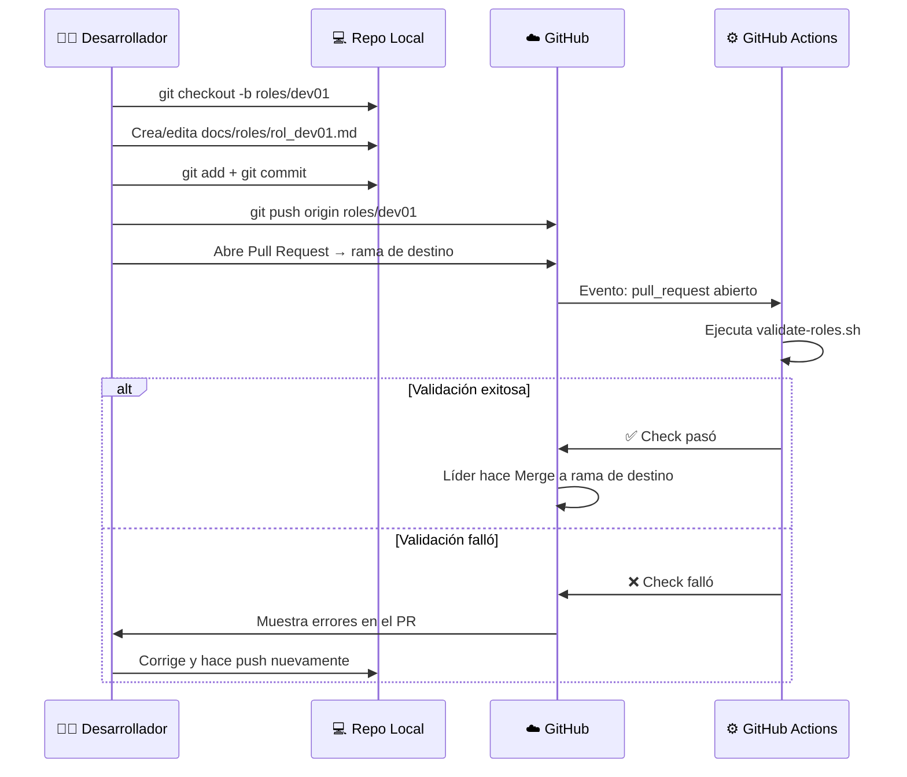

# Workflow de Git + GitHub Actions — Guía para el Equipo

## 1. Sobre el README y los archivos `.md`

GitHub **no** "importa" ni "compila" el contenido de un archivo `.md` dentro de otro. Lo que sí hace es:

- **Renderizar enlaces:** Si en el `README.md` pones `[rol_lider.md](docs/roles/rol_lider.md)`, GitHub lo muestra como un enlace clickeable. Al hacer clic, se abre ese archivo y se renderiza su contenido en pantalla completa.
- **Tablas bonitas:** En el README usamos una tabla con los 6 archivos esperados. Cada nombre es un enlace. Cuando el archivo exista, el enlace funcionará y mostrará el contenido del rol de ese miembro.

> [!NOTE]
> El README actúa como un **índice/portal**. GitHub renderiza cada `.md` de forma individual cuando alguien navega a él.

---

## 2. ¿Qué es GitHub Actions y cómo funciona?

GitHub Actions es un servicio **gratuito** (para repos públicos y con 2,000 min/mes para privados) que ejecuta scripts automáticamente cuando ocurren ciertos eventos en tu repositorio.

En nuestro caso, hemos configurado un workflow en `.github/workflows/validar-roles.yml` que dice:

```
"Cada vez que alguien abra un Pull Request hacia main, 
ejecuta el script scripts/validate-roles.sh"
```

Ese script verifica:
1. ¿Existen los 6 archivos de rol?
2. ¿Cada archivo tiene las 3 secciones obligatorias?
3. ¿La fecha tiene formato `YYYY-MM-DD`?

Si algo falla, el Pull Request mostrará una ❌ roja. Si todo pasa, mostrará un ✅ verde.

---

## 3. El Workflow Usual de Git (Paso a Paso)

Imagina que eres **dev01** y necesitas subir tu archivo `rol_dev01.md`.

### Paso 1: Clonar el repo (Solo la primera vez)
```bash
git clone https://github.com/tu-org/psico-deli-coreria.git
cd psico-deli-coreria
```

### Paso 2: Asegurarte de tener la última versión de `main`
```bash
git checkout main
git pull origin main
```

### Paso 3: Crear tu rama de trabajo
```bash
git checkout -b roles/dev01
```
> [!TIP]
> Usa nombres descriptivos para las ramas. Ejemplos:
> - `roles/dev01` — Para subir tu archivo de rol
> - `feature/login-api/dev01` — Para una funcionalidad del backend
> - `fix/error-conexion-db/dev01` — Para corregir un bug

### Paso 4: Crear tu archivo
Copia la plantilla y llénala con tu información:
```bash
cp docs/roles/PLANTILLA.md docs/roles/rol_dev01.md
# Edita el archivo con VS Code u otro editor
```

### Paso 5: Verificar localmente (Opcional pero recomendado)
```bash
bash scripts/validate-roles.sh
```

### Paso 6: Agregar, hacer commit y push
```bash
git add docs/roles/rol_dev01.md
git commit -m "docs: agregar archivo de rol para dev01"
git push origin roles/dev01
```

### Paso 7: Crear el Pull Request en GitHub
Después del push, ve a GitHub (en el navegador). Verás un banner amarillo que dice:

> *"roles/dev01 had recent pushes — Compare & pull request"*

Haz clic en **"Compare & pull request"** y llena:
- **Título:** `Agregar rol dev01`
- **Descripción:** `Agrego mi archivo de rol con la información solicitada`
- **Base branch:** `setup/inicial` (o la rama de destino)

Haz clic en **"Create pull request"**.

### Paso 8: GitHub Actions ejecuta las validaciones
En este momento, **automáticamente**, GitHub Actions levanta una VM gratuita de Ubuntu y ejecuta `scripts/validate-roles.sh`. Verás el resultado directamente en la página del Pull Request:

- ✅ **Verde:** Todo correcto. El PR puede ser aprobado.
- ❌ **Rojo:** Hay errores. Haz clic en "Details" para ver qué falló. Corrige tu archivo, haz commit y push de nuevo a la misma rama — el test se re-ejecutará automáticamente.

### Paso 9: Revisión y Merge
La persona quien tenga permisos revisa el PR:
- Si está bien → Hace clic en **"Merge pull request"** → Los cambios de `roles/dev01` se integran a `main`.
- Si hay que corregir algo, deja un comentario en el PR y vuelve al paso 5.

---

## 4. Diagrama Visual del Flujo



---

## 5. Preguntas Frecuentes

### ¿Cuándo se ejecutan los tests?
Los tests se ejecutan cuando alguien **abre o actualiza un Pull Request** hacia `main`. **No** se ejecutan en el push directo a la rama del desarrollador, sino cuando esa rama se "propone" para entrar a `main` mediante un PR.

### ¿Puedo hacer push directo a main?
Técnicamente sí, pero **no deberías**. Lo recomendable es proteger la rama `main` en la configuración de GitHub:
> Settings → Branches → Add rule → Branch name: `main`
> - ✅ Require a pull request before merging
> - ✅ Require status checks to pass before merging

Así nadie puede meter código roto directamente.

### ¿Qué pasa si faltan archivos de otros compañeros?
El test **fallará** porque el script busca los 6 archivos. Esto es **intencional**: el equipo solo "pasa" cuando **todos** han contribuido. Cada miembro debe crear su PR individual, y el merge final a main solo estará limpio cuando estén los 6 archivos.

### ¿Necesito hacer `git pull` antes de mi push?
Es una **excelente práctica**. Antes de hacer push, ejecuta:
```bash
git pull origin main --rebase
```
Esto "rebasa" tus cambios encima de los más recientes de main, evitando conflictos.

### ¿Más adelante, cuando subamos código real (Java/TypeScript)?
Agregaremos más workflows de GitHub Actions para:
- Compilar el backend con `./gradlew build`
- Correr los tests unitarios
- Verificar que el frontend compile con `pnpm build`

El flujo será exactamente el mismo: rama → PR → Actions valida → merge si pasa.
